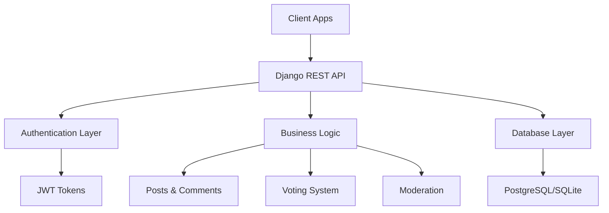

# 🔥 Reblaze API

<div align="center">
  
  **A powerful Reddit-style backend API built with Django REST Framework**
  
  [](https://djangoproject.com/)
  [](https://www.django-rest-framework.org/)
  [](https://python.org/)
  [](https://jwt.io/)
  
  [Features](#-features) • [Quick Start](#-quick-start) • [API Docs](#-api-endpoints) • [Contributing](#-contributing)
  
</div>

---

## 🚀 Overview

Reblaze is a full-featured Reddit-clone backend API that provides all the essential functionality for building a modern social media platform. Built with Django and Django REST Framework, it offers robust user management, community creation, content sharing, and moderation capabilities.

### 🎯 Why Reblaze?

- **🔐 Secure Authentication** - JWT-based auth with user management
- **🏘️ Community-Driven** - Create and manage subreddits with moderation
- **📱 Modern API Design** - RESTful endpoints with comprehensive features
- **⚡ High Performance** - Optimized queries and efficient data handling
- **🛡️ Moderation Tools** - Built-in moderation system for communities
- **📊 Engagement Features** - Voting, comments, and karma system

---

## ✨ Features

<table>
<tr>
<td width="50%">

### 👤 **User Management**
- ✅ User Registration & Login
- ✅ JWT Token Authentication  
- ✅ User Profiles with Karma
- 🔄 Password Reset *(Coming Soon)*

### 🌐 **Communities (Subreddits)**
- ✅ Create & Browse Communities
- ✅ Community Details & Posts
- ✅ Moderator System
- 🔄 Rules & Markdown Support *(Coming Soon)*

</td>
<td width="50%">

### 📝 **Content System**
- ✅ Rich Post Creation
- ✅ Media Attachments
- ✅ Nested Comments
- ✅ Edit/Delete Permissions
- 🔄 Post Flairs *(Coming Soon)*

### ⚡ **Engagement**
- ✅ Upvote/Downvote Posts
- ✅ Score Tracking
- ✅ Smart Pagination
- ✅ Multiple Sorting Options

</td>
</tr>
</table>

---

## 🏗️ Architecture



---

## 🚀 Quick Start

### Prerequisites
- Python 3.8+
- Django 4.x
- Django REST Framework

### Installation

1. **Clone the repository**
   ```bash
   git clone https://github.com/yourusername/reblaze-api.git
   cd reblaze-api
   ```

2. **Create virtual environment**
   ```bash
   python -m venv venv
   source venv/bin/activate  # On Windows: venv\Scripts\activate
   ```

3. **Install dependencies**
   ```bash
   pip install -r requirements.txt
   ```

4. **Configure database**
   ```bash
   python manage.py makemigrations
   python manage.py migrate
   ```

5. **Create superuser**
   ```bash
   python manage.py createsuperuser
   ```

6. **Run the server**
   ```bash
   python manage.py runserver
   ```

🎉 **API is now running at** `http://localhost:8000/`

---

## 📚 API Endpoints

### 🔐 Authentication
```http
POST   /auth/register/          # User registration
POST   /auth/login/             # User login
POST   /auth/logout/            # User logout
```

### 👤 Users
```http
GET    /users/profile/          # Get current user profile
PUT    /users/profile/          # Update user profile
```

### 🌐 Subreddits
```http
GET    /subreddits/             # List all subreddits
POST   /subreddits/             # Create subreddit
GET    /subreddits/{id}/        # Get subreddit details
PUT    /subreddits/{id}/        # Update subreddit (mods only)
DELETE /subreddits/{id}/        # Delete subreddit (admin only)
```

### 📝 Posts
```http
GET    /subreddits/{id}/posts/  # List posts in subreddit
POST   /subreddits/{id}/posts/  # Create new post
GET    /posts/{id}/             # Get post details
PUT    /posts/{id}/             # Update post (author/mod)
DELETE /posts/{id}/             # Delete post (author/mod)
```

### 💬 Comments
```http
GET    /posts/{id}/comments/    # List post comments
POST   /posts/{id}/comments/    # Add comment
PUT    /comments/{id}/          # Update comment (author/mod)
DELETE /comments/{id}/          # Delete comment (author/mod)
```

### ⬆️⬇️ Voting
```http
POST   /posts/{id}/vote/        # Vote on post (up/down)
DELETE /posts/{id}/vote/        # Remove vote
```

### 🔧 Query Parameters
- `?page=1&page_size=20` - Pagination
- `?sort=new|top|hot` - Sorting options
- `?search=keyword` - Search functionality

---

## 🏛️ Database Schema

<details>
<summary>Click to view database structure</summary>

```sql
-- Key Models Overview
Users
├── id, username, email, password
├── karma, created_at, updated_at
└── is_active, is_staff

Subreddits
├── id, name, title, description
├── creator, created_at, updated_at
└── subscriber_count, post_count

Posts
├── id, title, content, media_url
├── author, subreddit, created_at
├── updated_at, score, vote_count
└── is_deleted

Comments  
├── id, content, parent_comment
├── author, post, created_at
├── updated_at, score, depth
└── is_deleted

Votes
├── id, user, post, vote_type
└── created_at

SubredditModerators
├── id, user, subreddit
├── added_by, added_at
└── permissions
```

</details>

---

## 🎯 Usage Examples

### Creating a Post
```python
import requests

# Login first
auth_response = requests.post('http://localhost:8000/auth/login/', {
    'username': 'your_username',
    'password': 'your_password'
})
token = auth_response.json()['access']

# Create post
headers = {'Authorization': f'Bearer {token}'}
post_data = {
    'title': 'My Amazing Post',
    'content': 'This is the content of my post!',
    'subreddit': 1
}

response = requests.post(
    'http://localhost:8000/subreddits/1/posts/',
    json=post_data,
    headers=headers
)
```

### Voting on Content
```python
# Upvote a post
vote_data = {'vote_type': 'up'}
requests.post(
    'http://localhost:8000/posts/1/vote/',
    json=vote_data,
    headers=headers
)
```

---

## 🛠️ Development

### 📋 Roadmap

<table>
<tr>
<th>🔄 In Progress</th>
<th>📅 Planned</th>
<th>💡 Ideas</th>
</tr>
<tr>
<td>

- Password Reset Flow
- Comment Voting
- Hot Sorting Algorithm
- Swagger Documentation

</td>
<td>

- Post Flair System  
- Cross-posting
- Moderator Audit Logs
- Rate Limiting
- Email Verification

</td>
<td>

- Real-time Notifications
- Chat System
- Advanced Search
- Content Recommendations
- Mobile App Support

</td>
</tr>
</table>

### 🧪 Running Tests
```bash
python manage.py test
```

### 📊 Code Coverage
```bash
pip install coverage
coverage run --source='.' manage.py test
coverage report
```

---

## 🤝 Contributing

We love contributions! Here's how you can help:

1. **🍴 Fork the repository**
2. **🌿 Create your feature branch** (`git checkout -b feature/AmazingFeature`)
3. **💾 Commit your changes** (`git commit -m 'Add some AmazingFeature'`)
4. **📤 Push to the branch** (`git push origin feature/AmazingFeature`)
5. **🔃 Open a Pull Request**

### 📝 Contribution Guidelines
- Follow PEP 8 style guidelines
- Write tests for new features
- Update documentation as needed
- Keep commits atomic and well-described

---

## 📜 License

This project is licensed under the MIT License - see the [LICENSE](LICENSE) file for details.

---

## 🙏 Acknowledgments

- **Django Team** - For the amazing web framework
- **DRF Team** - For the powerful REST framework  
- **Contributors** - For making this project better
- **Community** - For feedback and support

---

<div align="center">

### ⭐ Star this repo if you found it helpful!

**[Report Bug](https://github.com/yourusername/reblaze-api/issues)** • **[Request Feature](https://github.com/yourusername/reblaze-api/issues)** • **[Documentation](https://github.com/yourusername/reblaze-api/wiki)**

<<<<<<< HEAD
Made with ❤️ by [Your Name](https://github.com/yourusername)
=======
Made with ❤️ by [Team Semicolon](https://github.com/yourusername)
>>>>>>> 551e2cb (Updated Everythings)

</div>
